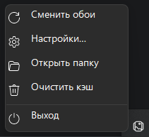
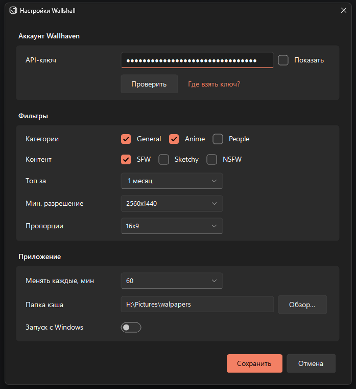

# Wallshall

Меняет обои рабочего стола Windows на картинки из топа [Wallhaven](https://wallhaven.cc). Живёт в трее, настраивается в одном окне.



## Возможности

- Обои меняются по таймеру и по клику, повторов нет: показанные картинки запоминаются.
- Страницы топа проходятся по порядку, в новый день всё начинается сначала.
- Картинки скачиваются со страницы про запас, поэтому при недоступном сайте смена продолжается из кэша.
- Настройки: API-ключ, категории, SFW / Sketchy / NSFW, период топа, минимальное разрешение, пропорции, интервал, папка кэша, автозапуск.
- API-ключ хранится зашифрованным средствами Windows (DPAPI).
- В папке кэша трогаются только собственные файлы `wallhaven-*`, так что её можно указать хоть в «Изображения».



## Установка

Скачай `Wallshall.exe` из [Releases](../../releases) и запусти. Ничего доустанавливать не нужно: .NET упакован внутрь.

Автозапуск включается в настройках программы.

## Сборка

Через Docker, переключать Docker Desktop на Windows-контейнеры не нужно:

```sh
docker build -o dist .
```

Через .NET SDK:

```sh
dotnet publish src/Wallshall/Wallshall.csproj -c Release -r win-x64 \
  -p:EnableWindowsTargeting=true -p:PublishSingleFile=true --self-contained false -o dist
```

Готовый `Wallshall.exe` появится в `dist`. Такая сборка требует установленный [.NET 8 Desktop Runtime](https://dotnet.microsoft.com/download/dotnet/8.0/runtime) — она быстрее собирается и весит пару мегабайт. Для сборки, которая работает сама по себе (как в Releases), замени `--self-contained false` на `--self-contained true` и добавь `-p:EnableCompressionInSingleFile=true`.

## Как это работает

Программа запрашивает топ через `https://wallhaven.cc/api/v1/search` и ставит выбранный файл обоями через `SystemParametersInfo`. Ключ передаётся заголовком `X-API-Key` и нужен только для NSFW.

Данные лежат в `%LOCALAPPDATA%\Wallshall`:

| Файл / папка    | Что внутри                              |
|-----------------|------------------------------------------|
| `settings.json` | настройки, ключ в зашифрованном виде     |
| `state.json`    | текущая страница топа и история показов  |
| `cache\`        | скачанные картинки (папку можно сменить) |

## Структура проекта

```
wallshall/
├─ .github/workflows/build.yml   сборка .exe на GitHub Actions
├─ docs/                         скриншоты для README
├─ src/Wallshall/
│  ├─ Program.cs                 точка входа
│  ├─ TrayApp.cs                 трей, таймер, загрузка и смена обоев
│  ├─ AppSettings.cs             настройки и их хранение
│  ├─ Autostart.cs               автозапуск через реестр
│  ├─ UI/
│  │  ├─ Theme.cs                цвета, шрифты, тёмные заголовки окон
│  │  ├─ DarkControls.cs         меню, кнопки, поля, карточки, диалоги
│  │  └─ SettingsForm.cs         окно настроек
│  ├─ Assets/wallpaper.ico       иконка
│  └─ Wallshall.csproj
├─ Dockerfile
└─ README.md
```

## Лицензия

MIT