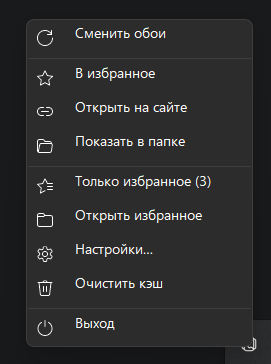
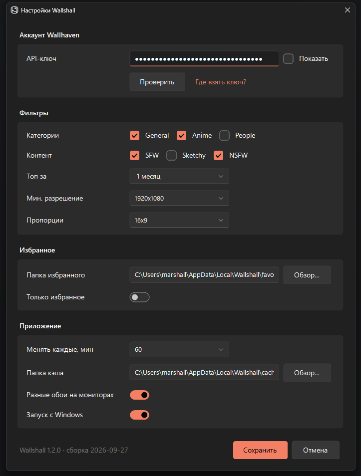

# Wallshall

Меняет обои рабочего стола Windows на картинки из топа [Wallhaven](https://wallhaven.cc). Живёт в трее, настраивается в одном окне.



## Возможности

- Обои меняются по таймеру и по клику, повторов нет: показанные картинки запоминаются.
- Страницы топа проходятся по порядку, в новый день всё начинается сначала.
- Картинки скачиваются со страницы про запас, поэтому при недоступном сайте смена продолжается из кэша.
- На нескольких мониторах можно включить свою картинку для каждого.
- Понравившиеся обои сохраняются в избранное одним пунктом меню, а режим «Только избранное» крутит их по кругу.
- Пропорции выбираются по нескольку сразу, с кнопками «Все широкие» и «Все вертикальные».
- Настройки: API-ключ, категории, SFW / Sketchy / NSFW, период топа, минимальное разрешение, пропорции, интервал, папки кэша и избранного, разные обои на мониторах, автозапуск.
- API-ключ хранится зашифрованным средствами Windows (DPAPI).
- В папке кэша трогаются только собственные файлы `wallhaven-*`, так что её можно указать хоть в «Изображения».



## Установка

Скачай `Wallshall.exe` из [Releases](../../releases) и запусти. Ничего доустанавливать не нужно: .NET упакован внутрь.

Автозапуск включается в настройках программы.

## Использование

Программа живёт в трее, своего окна у неё нет.

- **Двойной клик по значку в трее** — сменить обои прямо сейчас, не дожидаясь таймера.
- **Правый клик** открывает меню.
- Наведи курсор на значок — в подсказке видно, какая картинка стоит сейчас или что пошло не так.

Пункты меню:

| Пункт | Что делает |
|-------|------------|
| Сменить обои | ставит следующую картинку, не дожидаясь таймера |
| В избранное | сохраняет текущие обои в папку избранного; если они уже там, пункт превращается в «Убрать из избранного» |
| Открыть на сайте | открывает страницу картинки на Wallhaven — там автор, теги и оригинал |
| Показать в папке | открывает проводник с выделенным файлом обоев |
| Только избранное (N) | тумблер: обои идут случайно по кругу из избранного, а не из топа. В скобках — сколько картинок в избранном |
| Открыть избранное | открывает папку избранного |
| Настройки… | окно настроек |
| Очистить кэш | удаляет скачанное и историю показов; избранное не трогает |

Когда на мониторах разные обои, первые три пункта заменяются строкой на каждый монитор — с миниатюрой картинки и подменю тех же действий. Так избранное собирается по одной картинке, а не сразу со всех экранов:

```
↻  Сменить обои
──────────────────────────
▤  Левый · o5kxm9      ▸     ☆  В избранное
▤  Правый · 7dqp2v ★   ▸     🔗  Открыть на сайте
──────────────────────────   📁  Показать в папке
☰  Только избранное (12)  ✓
...
```

Мониторы называются по расположению — «Левый» и «Правый», для вертикальной пары «Верхний» и «Нижний», для трёх в ряд добавляется «Центральный». Если раскладка сложнее, они нумеруются. Звёздочка в строке означает, что картинка уже в избранном.

## Избранное

Избранное — это обычная папка, по умолчанию `%LOCALAPPDATA%\Wallshall\favorites`. Её можно сменить в настройках, например на папку в облаке, чтобы коллекция синхронизировалась между компьютерами.

- «В избранное» копирует файл, а не переносит: оригинал остаётся в кэше и однажды будет вычищен, а копия в избранном — нет.
- В режиме «Только избранное» картинки идут в случайном порядке, но по кругу: пока не покажутся все, ни одна не повторится. Потом круг начинается заново.
- Свои картинки тоже работают — просто положи их в папку избранного, скачивать их с Wallhaven не нужно.
- На нескольких мониторах за раз берутся разные картинки из избранного, а добавлять и убирать их можно по одной — через строку нужного монитора.
- Папки кэша и избранного должны быть разными, иначе очистка кэша удалила бы коллекцию. Программа это проверяет.

## API-ключ

Без ключа программа работает: обычный топ Wallhaven доступен всем, и для SFW и Sketchy ключ не нужен.

Ключ нужен ровно для одного — **чтобы в выдачу попадали NSFW-картинки**. Сайт отдаёт их только авторизованным пользователям, поэтому без ключа переключатель NSFW сохранить нельзя.

Взять ключ можно на странице [настроек аккаунта Wallhaven](https://wallhaven.cc/settings/account), в разделе API. Дальше вставь его в поле «API-ключ» и нажми «Проверить», чтобы убедиться, что он принят. Ключ хранится в зашифрованном виде и передаётся сайту заголовком `X-API-Key`, то есть не попадает ни в адреса запросов, ни в логи.

## Пропорции

Пропорции в настройках выбираются кнопками, можно отметить сразу несколько — тогда подойдут обои любой из отмеченных.

| Кнопка | Что отправляется в API |
|--------|------------------------|
| Любые | параметр `ratios` не отправляется |
| Все широкие | `ratios=landscape` — любые горизонтальные |
| Все вертикальные | `ratios=portrait` — любые вертикальные |
| 16×9, 9×16, 1×1 и прочие | `ratios=16x9,9x16` — список отмеченных |

«Все широкие» и «Все вертикальные» не комбинируются с обычными пропорциями: Wallhaven в таком случае молча игнорирует ключевое слово и отдаёт только обычные. Поэтому программа гасит одно при выборе другого. Друг с другом два ключевых слова уживаются.

Если в настройках окажется сохранённая вручную пропорция, которой нет среди кнопок, она не потеряется — появится в строке «Другие», откуда её можно снять.

## Сборка

Через Docker, переключать Docker Desktop на Windows-контейнеры не нужно:

```sh
docker build -o dist .
```

Через .NET SDK:

```sh
dotnet publish src/Wallshall/Wallshall.csproj -c Release -r win-x64 \
  -p:EnableWindowsTargeting=true -p:PublishSingleFile=true --self-contained false -o dist
```

Готовый `Wallshall.exe` появится в `dist`. Такая сборка требует установленный [.NET 8 Desktop Runtime](https://dotnet.microsoft.com/download/dotnet/8.0/runtime) — она быстрее собирается и весит пару мегабайт. Для сборки, которая работает сама по себе (как в Releases), замени `--self-contained false` на `--self-contained true` и добавь `-p:EnableCompressionInSingleFile=true`.

## Как это работает

Программа запрашивает топ через `https://wallhaven.cc/api/v1/search`. Обои ставятся через `SystemParametersInfo`, а если для каждого монитора своя картинка — через COM-интерфейс `IDesktopWallpaper`.

Данные лежат в `%LOCALAPPDATA%\Wallshall`:

| Файл / папка    | Что внутри                              |
|-----------------|------------------------------------------|
| `settings.json` | настройки, ключ в зашифрованном виде     |
| `state.json`    | текущая страница топа и история показов  |
| `cache\`        | скачанные картинки (папку можно сменить) |
| `favorites\`    | избранное (папку можно сменить)          |

## Структура проекта

```
wallshall/
├─ .github/workflows/build.yml   сборка .exe на GitHub Actions
├─ docs/                         скриншоты для README
├─ src/Wallshall/
│  ├─ Program.cs                 точка входа
│  ├─ TrayApp.cs                 трей, таймер, смена обоев
│  ├─ WallhavenApi.cs            запросы к сайту и скачивание картинок
│  ├─ Cache.cs                   папка с картинками: выбор, чистка, перенос
│  ├─ Favorites.cs               избранное: добавление, удаление, ротация по кругу
│  ├─ RatioSelection.cs          правила выбора пропорций
│  ├─ State.cs                   страница топа, история показов, текущие обои
│  ├─ AppInfo.cs                 название, версия и дата сборки
│  ├─ AppSettings.cs             настройки и их хранение
│  ├─ Autostart.cs               автозапуск через реестр
│  ├─ Wallpaper.cs               установка обоев, в том числе по мониторам
│  ├─ Shell.cs                   открытие папок и ссылок
│  ├─ UI/
│  │  ├─ Theme.cs                цвета, шрифты, тёмные заголовки окон
│  │  ├─ DarkControls.cs         меню, кнопки, поля, карточки, диалоги
│  │  ├─ RatioPicker.cs          кнопки выбора пропорций
│  │  └─ SettingsForm.cs         окно настроек
│  ├─ Assets/wallpaper.ico       иконка
│  └─ Wallshall.csproj
├─ Dockerfile
└─ README.md
```

## Лицензия

MIT
